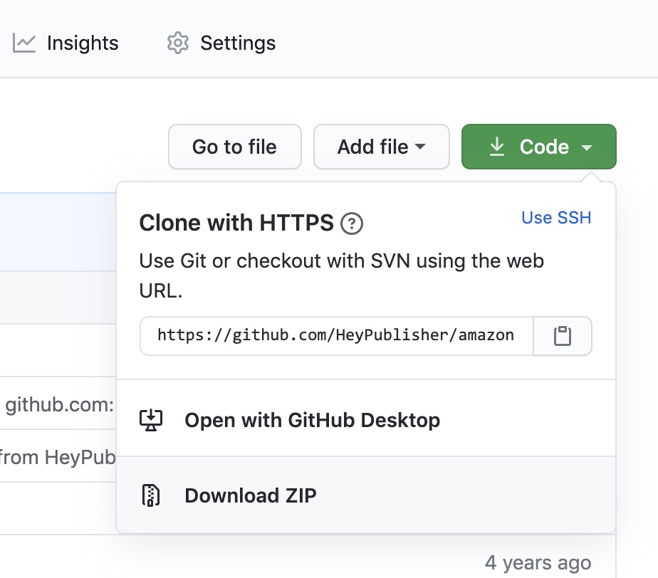
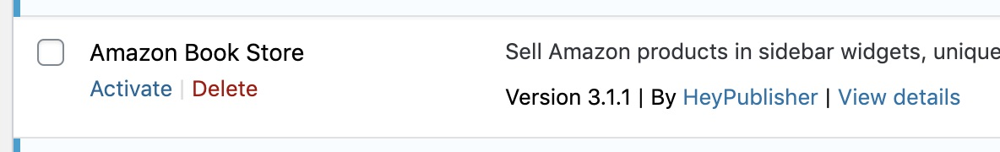
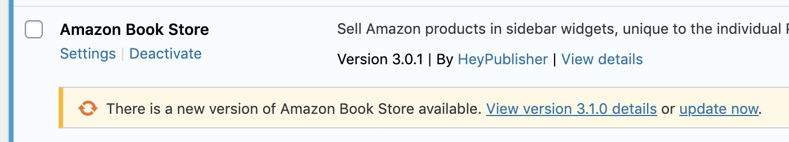
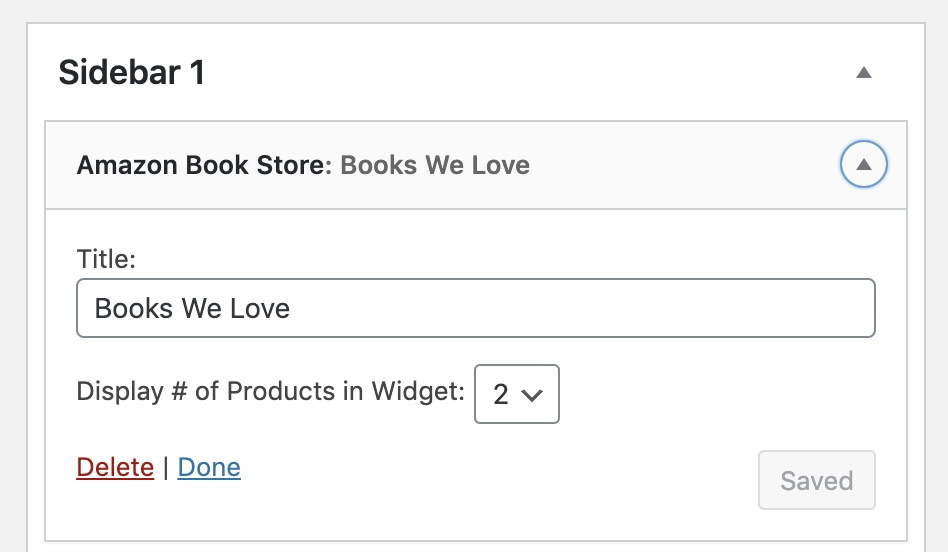
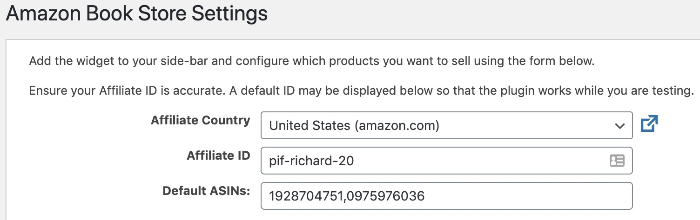
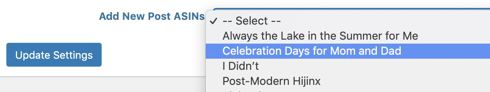
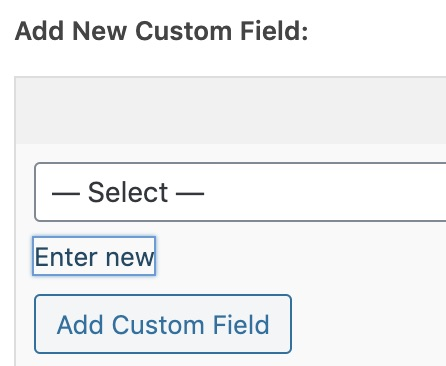
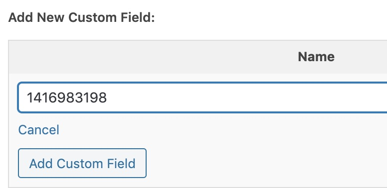
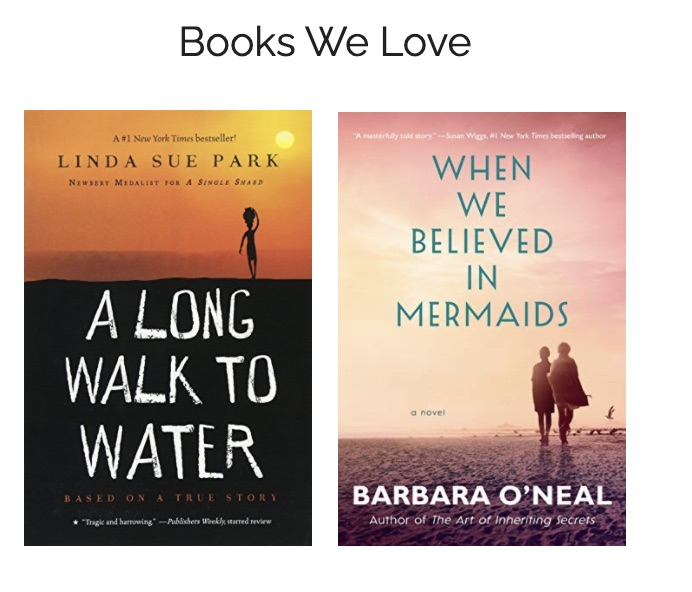
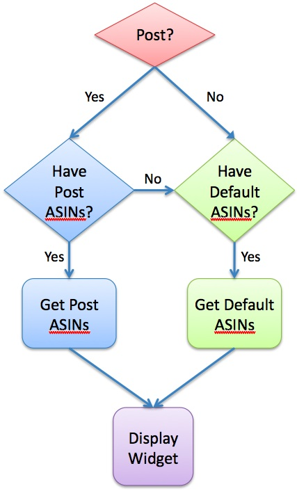

## Amazon Book Store

Sell Amazon products in sidebar widgets, unique to the individual POST or generically from a default pool of products that you define.

### Description

The Amazon Book Store (formerly 'Support Great Writers') Widget provides a very simple way to sell Amazon products via a sidebar widget on your blog, magazine, or other WordPress-powered website.  The widget can be instantiated multiple times, with different products being displayed in each instance.  

You can sell specific products on specific pages of your website, or define a 'pool' of products from which the widget will randomly chose.  This allows you to quickly build up an Amazon store of products that are related to your individual POSTs.  

### Installation

#### Install Plugin

* Go to the [GitHub repository](https://github.com/HeyPublisher/amazon-book-store) and download the plugin.

* Click on the Download ZIP link and save it in your `wp-content/plugins` directory.

* Extract the files to a sub-directory called `support-great-writers`.  _This will ensure you can install from either WordPress or GitHub without conflict._

  *Using cURL, you can do all of the above with one command:*

  `curl -Lo sgw.zip https://github.com/HeyPublisher/support-great-writers/archive/master.zip && unzip sgw.zip && mv support-great-writers-master support-great-writers`

* Active the plugin via the WordPress plugin menu.

* You can keep the plugin updated within WordPress by clicking on the link.

#### Install and Configure Widget

##### Install the Widget

* Navigate to **Appearance > Widgets** in the WordPress Admin menu
* Drag the 'Amazon Book Store' widget to your sidebar.
* Give the widget a title
* Select whether to display 1 or 2 products at a time in the sidebar
* Click the "Save" button

##### Basic Settings

* Navigate to **Settings > Amazon Book Store** in the WordPress Admin menu
* Select the country for your Amazon Affiliate ID
* Input your own Amazon Affiliate ID
  * You can register as an [Amazon Affiliate here](https://affiliate-program.amazon.com)
* Input a comma-separated list of ASINs you want to display when a POST-specific override has not be provided
  * See [How to Find Amazon ASINs](https://www.amazon.com/gp/seller/asin-upc-isbn-info.html) for more information

##### Advanced Settings

You can add POST-specific ASIN's from the Settings page by doing:
* Click the "Select" drop-down list next to the **Add New Post ASINs** label at the bottom of the screen
* Select the POST you want to add ASINs for
  * The screen will update, displaying the post name with an input field

* Input the ASINs you want
* Click the **Update Settings** button when done

You can also add POST-specific ASIN's directly from the POST Edit screen by doing:

* Edit the POST you want to configure
* At the bottom of the Edit screen you will see the **Custom Fields** editor
* Click the ** Enter new** link

* Input a comma-separated list of ASINs you want to display
* Click the **Add Custom Field** button to save your selection

You can Add or Edit ASINs from either the plugin settings page, or from an individual POST's Edit screen.

### Frequently Asked Questions

* **How many ASINs can I use per POST?**  The widget allows a maximum of 10 ASINs per POST.
* **But the plugin only shows 2 products at a time?** If you have more ASINs configured than the plugin can display, it will randomize the products to display.  

* **How can I track if people are clicking or buying?**  Login to your [Amazon Affiliate](https://affiliate-program.amazon.com) account and look for the Affiliate ID you used in the Settings.  Clicks can sometimes take up to 24 hours to display in your Affiliate report.
* **How does the plugin decide which ASINs to display?** The plugin will use the following logic.

* **What if I find a bug?** [Tell us about it](https://github.com/HeyPublisher/amazon-book-store/issues).  You can create an issue at GitHub and we will fix it as soon as possible.
